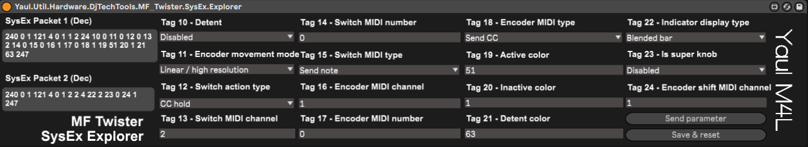

# MaxForLive - MF Twister SysEx Explorer
Format SysEx &amp; configure your MF Twister directly from MaxMSP / MaxForLive

## Versions
Ableton Live 11
Max 8.1.11

## Changelog
17 Feb 2022 - version 1

## Description
**To be done.**

## Setup
Drag your device into a MIDI track, set your MF Twister as MIDI out. If well configured, pressing "Save & reset" should reset your device.
When sending a parameter, the device goes into a configuration mode (no color, no response) until the device is reset or unplugged.